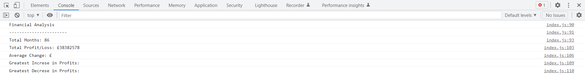

## Table of contents

- [Overview](#overview)
  - [The challenge](#the-challenge)
  - [Screenshot](#screenshot)
  - [Links](#links)
- [Author](#author)

## Overview

### The challenge

* My first contact with javaScript.
* Not much, I need to get a lot more knowledge before creating good stuff
* But you can use it to check your own finances :D
* When creating it I have learned things like .push, .reduce and few more basics of javascript

### Screenshot

* 

### Links

* You can see deployed project here: https://skwiera-magic.github.io/console-finances/

## Author
- Skwiera-Magic - [My GitHub](https://github.com/Skwiera-Magic/)
